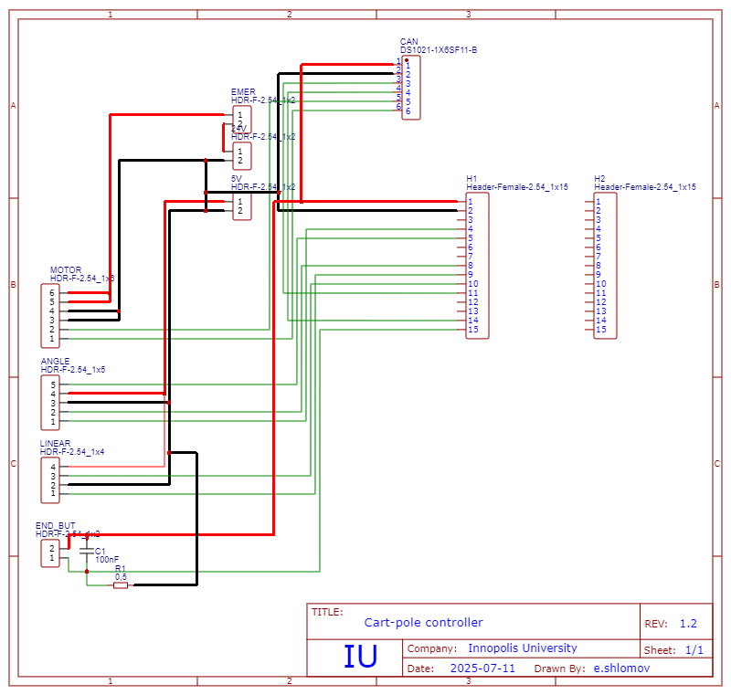
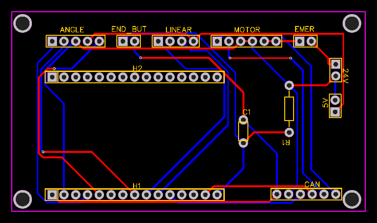

Electronics and Schematics
==========================

The Total Control system uses an ESP32-based controller board designed for real-time cart-pole control.

Connector Interfaces
--------------------
.. list-table:: 
   :header-rows: 1
   :widths: 20 30 50

   * - Label
     - Connector Type
     - Function
   * - **MOTOR**
     - HDR-F-2.54_1x6
     - Brushless motor control (CAN interface)
   * - **ANGLE**
     - HDR-F-2.54_1x5
     - Pole angle sensor (Infineon TLE5012B)
   * - **LINEAR**
     - HDR-F-2.54_1x4
     - Cart position encoder (SEAVDAN H9740)
   * - **END_BUT**
     - HDR-F-2.54_1x4
     - Rail end-stop switches
   * - **EMER**
     - HDR-F-2.54_1x5
     - Emergency stop button (hardware cutoff)
   * - **DATA**
     - 0.01×4
     - Serial debug (SWD interface)

Schematic Diagrams
------------------

   
   *Main circuit schematic (Rev 1.2) showing signal routing and component relationships*

PCB Layout
----------

   
   *Final PCB design with optimized trace routing for noise immunity*
